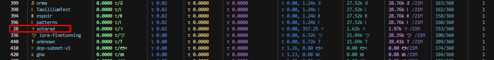
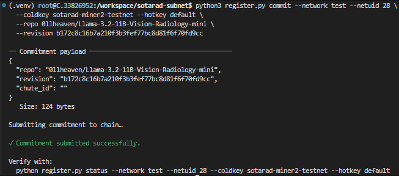
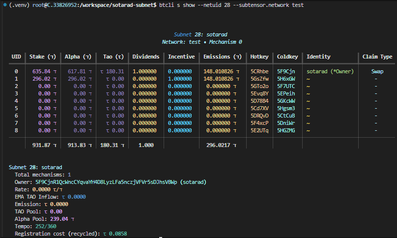

# Proof of Testnet deployment

## Subnet Registration

We've registered `sotarad` subnet on testnet uid 28.

## Miner Model Submission

The below is the screenshot when miner submits its model by writing on-chain commitment.

## Validator

The following is the validator log file.

[validator-output.log](../validator-output.log)

## Weight-setting

The below is the screenshot of subnet status where miner UID 1 is getting all incentives.

